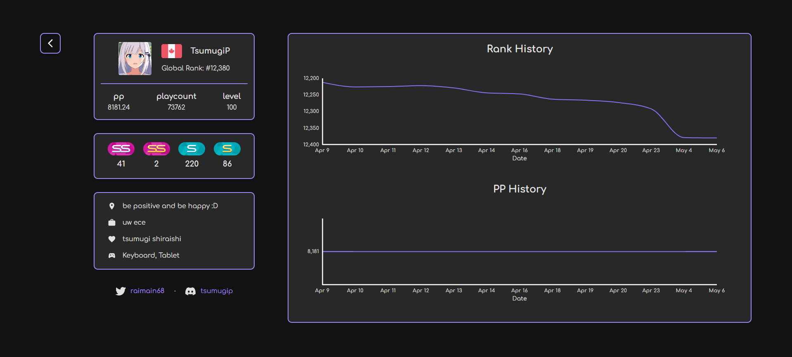

# osu! Stat Tracker
## Overview

This project is an osu! stat tracker designed to provide players with detailed statistics and historical data about their performance in the game. It uses React with TypeScript for the front end and Django with Python for the backend API.

## Features

- Track and display osu! player statistics
- View detailed performance metrics
- Compare performance across different time periods
- Visualize progress with interactive charts and graphs

## Technologies Used

- **Frontend**: React, TypeScript, Material UI
- **Backend**: Django, Django REST Framework
- **Database**: SQLite (for development)
- **Charts and Graphs**: Material UI

